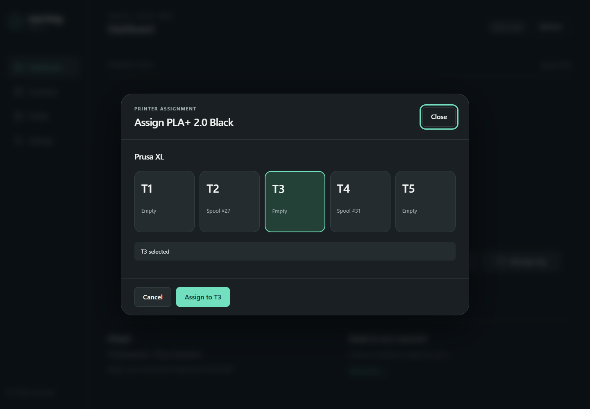

# Assign a spool to a printer

Map the identified spool to a selected Prusa XL toolhead through FilaBridge.

## Before you start

Resolved Spoolman spool, configured FilaBridge printer, current printer state and assignment capability. Verify the printer is in a suitable idle state.

## Steps

1. Choose **Assign** from Home or the WT32 Assign view.
2. Check the displayed printer name and spool number. Select the intended **T1–T5** toolhead.
3. Read the confirmation. If the slot is occupied, review the displaced spool and use the explicit **Replace** confirmation only if that is intended.
4. Confirm once and wait while the station sends the mapping and re-reads FilaBridge state.
5. Verify the UI reports the exact requested spool on the exact selected toolhead. If doing live acceptance, also inspect the mapping in FilaBridge.

## Expected result

Assignment is confirmed only after readback matches printer ID, backend toolhead ID and spool ID. The display uses T1–T5 while the backend uses IDs 0–4.

## If it fails

Offline, stale, active-print or unknown capability states can block normal assignment. Never repeatedly click through a network failure; refresh current mappings first. Disabled local toolhead profiles remain unavailable. Advanced overrides require deliberate understanding of the displayed warning.

