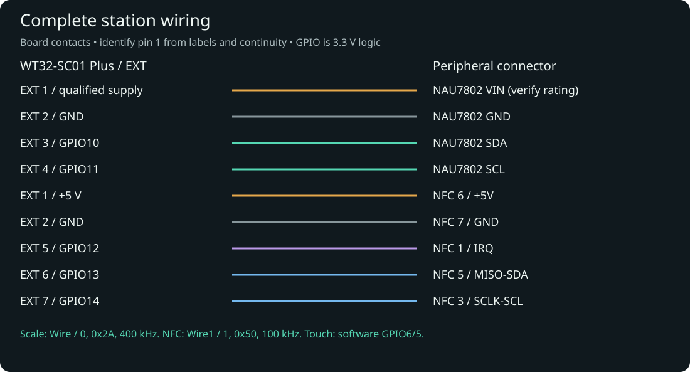
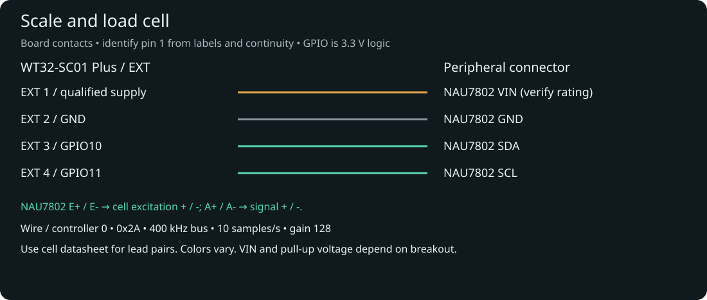
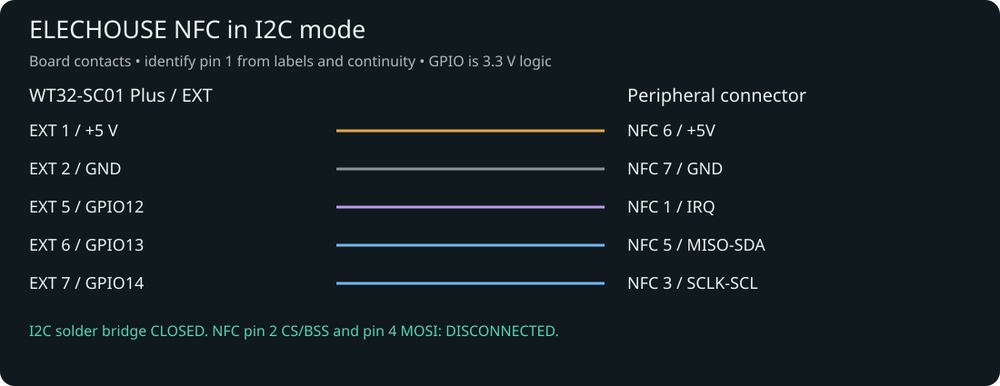

# Complete wiring

This procedure connects the supported controller, scale and NFC reader. You need
the [BOM](bill-of-materials.md), a multimeter, insulated wiring, the actual board
pin labels and a disconnected power supply. Use the normal OpenTag Station firmware
for validation.

The scale owns hardware `Wire` / controller 0. NFC owns `Wire1` / controller 1.
They are physically separate buses. Built-in touch uses LovyanGFX software I²C on
GPIO6/5, port −1, and must not be joined to either EXT bus.

## Orientation and pin 1

All numbers below refer to **board connector contacts**, not the loose cable's
wire-side view. The drawings are electrical connection diagrams, not mirrored
photographs. Identify WT32 EXT pin 1 by the board's `5V`/pin-1 marking and the
manufacturer's Hardware Interface figure; pin 2 is GND. On the documented NFC
connector, pin 1 is IRQ and the opposite end, pin 7, is GND.

View the board's component/connector side when matching labels. A cable held with
contacts toward you can reverse the apparent left-to-right order. Do not infer
pin 1 from red wire, latch direction, or a photo of another revision. With power
disconnected, use continuity from the **labeled board pad** to each harness end,
and label those ends before plugging in. If a revision lacks readable marks,
use its manufacturer's connector drawing and ground continuity to establish the
orientation; do not apply power until that mapping is unambiguous.

!!! warning "Power contacts are not GPIO"
    EXT pin 1 carries 5 V. GPIO signals are 3.3 V logic. A mirrored harness can put
    5 V on a data line. Verify contacts individually before first power.

## Master connection table

| Device | Pin / label | Connects to | WT32 EXT pin / GPIO | Notes |
|---|---|---|---|---|
| NAU7802 | VIN / VCC | Appropriate regulated supply for this breakout | EXT 1 / 5 V **only if breakout explicitly accepts 5 V** | Otherwise use a suitable regulated supply; verify pull-up voltage, see [power](power.md) |
| NAU7802 | GND | Common ground | EXT 2 / GND | Also reference for NFC and any separate regulator |
| NAU7802 | SDA | Scale data | EXT 3 / GPIO10 | `Wire`, 400 kHz normal operation |
| NAU7802 | SCL | Scale clock | EXT 4 / GPIO11 | Address `0x2A` |
| Load cell | Excitation + | NAU7802 E+ | None | Excitation from ADC breakout, not directly from 5 V |
| Load cell | Excitation − | NAU7802 E− | None | Bridge excitation return |
| Load cell | Signal + | NAU7802 A+ | None | Differential signal input |
| Load cell | Signal − | NAU7802 A− | None | Differential signal input |
| NFC | 1 IRQ | NFC interrupt | EXT 5 / GPIO12 | Required; not the onboard touch IRQ |
| NFC | 2 CS / BSS | **DISCONNECTED** | None | SPI-only chip select in this hookup |
| NFC | 3 SCLK / SCL | NFC clock | EXT 7 / GPIO14 | `Wire1`, 100 kHz |
| NFC | 4 MOSI | **DISCONNECTED** | None | SPI-only data line |
| NFC | 5 MISO / SDA | NFC data | EXT 6 / GPIO13 | I²C address `0x50` |
| NFC | 6 +5V | 5 V supply | EXT 1 / 5 V | Module power, not signal voltage |
| NFC | 7 GND | Common ground | EXT 2 / GND | Required |
| WT32 | EXT 8 / GPIO21 | **DISCONNECTED** | EXT 8 | Not used by this product profile |

The NFC module exposes no reset or power-enable pin. Do not add an invented GPIO
for either. The table does not authorize wiring a bare NAU7802 chip to 5 V; the
breakout supply and logic specification must be known.

## Assemble the scale

1. Disconnect USB and any external power. Mount the load cell as described in
   [mechanical setup](mechanical.md), leaving the platform free to move.
2. Identify the breakout's VIN, GND, SDA, SCL, E+, E−, A+ and A− labels.
   Confirm its VIN range and I²C pull-up voltage before selecting the power lead.
3. Connect common ground, scale SDA to EXT 3 and scale SCL to EXT 4.
4. Wire the bridge excitation pair to E+/E− and signal pair to A+/A−.
   A common YZC-133 example is red E+, black E−, white A+, green A−;
   **colors are not universal**. Prefer the supplied cell's wiring sheet.
5. If colors differ, disconnect the cell and measure pair resistances to check
   the full-bridge topology against its datasheet. Resistance alone does not
   establish signal polarity or distinguish every symmetrical bridge. Identify
   excitation/signal pairs from the supplier drawing; do not guess from color.
6. Secure the cable to the fixed structure with slack at the cell. Check no lead
   can pull on the moving platform. Recheck continuity and polarity.

The normal driver configures gain 128, internal 3.0 V LDO and 10 samples/second.
The I²C clock is 400 kHz; the sample rate is a different quantity. Startup scans
GPIO10/11 once and reports `NAU7802: PRESENT at 0x2A`. If no device responds it
also checks reversed SDA/SCL once, then restores the production mapping. A hint
about reversed leads means correct the harness; firmware does not adopt it.

## Assemble NFC

1. Confirm the module is the supported ELECHOUSE `NFC_ST25R3916B` connector type.
2. With power disconnected, close the module's **I2C** solder bridge as shown in
   the [manufacturer guide](https://www.elechouse.com/st25r3916-esp32-i2c-quick-start/).
   Inspect for unintended shorts. Default SPI mode will not work on these wires.
3. Identify pin 1/IRQ and continuity-test each of the seven harness positions.
4. Connect 7/GND and 6/+5V, then 5/MISO-SDA to EXT 6/GPIO13,
   3/SCLK-SCL to EXT 7/GPIO14 and 1/IRQ to EXT 5/GPIO12.
5. Individually insulate and leave 2/CS-BSS and 4/MOSI **DISCONNECTED**.
6. Keep the antenna away from metal and the load-cell body. Begin validation with
   one approved tag near the antenna, not a stack of tagged spools.

## Before power

- Verify EXT 1 goes only to approved supply inputs; no short between power and ground.
- Verify all grounds are common and no independent supply back-feeds USB.
- Check scale and NFC SDA/SCL stay on their own buses and touch pins are untouched.
- Verify NFC IRQ, I²C bridge and both disconnected SPI-only contacts.
- Verify load-cell pairs, insulation, strain relief and platform clearance.

## After power: normal production firmware

1. Boot OpenTag Station. Observe the boot version and normal Home view; touch each
   navigation action to confirm the panel remains responsive.
2. In Settings → Scale, confirm the ADC is ready; serial at 115200 baud should
   report address `0x2A`. Apply a small safe load: raw counts must change.
3. Complete network/setup configuration if required. Inspect NFC status in the
   browser's advanced diagnostics; confirm the reader is ready on address `0x50`
   and NFC bus error counters remain zero during repeated checks.
4. Present one [approved tag](../openprinttag/supported-tags.md). Confirm detection
   and stable identity. A blank compatible tag is not yet a linked spool.
5. Remove/reinsert the tag, exercise touch and scale together, then perform
   [tare and calibration](../scale/calibration.md) with the platform unloaded first.
6. Record firmware SHA, result and observed faults. A successful device scan alone
   does not establish weighing accuracy or final physical release acceptance.

## Fault isolation

| Symptom | Likely cause | Check / expected result |
|---|---|---|
| NAU7802 absent | Supply, reversed SDA/SCL, wrong connector view | Voltage at breakout; EXT 3→SDA, 4→SCL; `0x2A` on scale bus |
| NFC reader absent | Open I²C bridge, wrong bus, power/ground | 5 V module supply, EXT 6→SDA, 7→SCL, bridge; `0x50` on NFC bus |
| NFC ready, no tag | Wrong tag family, antenna shielding, missing IRQ | Approved SLIX2, one tag close to antenna; EXT 5→IRQ; no SPI-only leads |
| Fixed/saturated counts | Open bridge, wrong excitation/signal pair | Inspect all four cell leads, ADC terminals and mechanical load; do not calibrate a saturated input |
| Backwards weight | Signal polarity or stale calibration | Confirm mapping; signed calibration supports orientation; recalibrate after any wire change |
| Drifting/noisy weight | Platform binding, loose terminals, cable force | Clear moving platform, relieve cables, stable base, repeat zero and known mass |
| Touch fails after NFC wiring | Shared bus/pin conflict or mode error | Restore GPIO6/5 touch software bus; NFC only GPIO13/14/12; inspect shorts |

See [pinout](pinout.md) for source checks and [power](power.md) for supply constraints.
