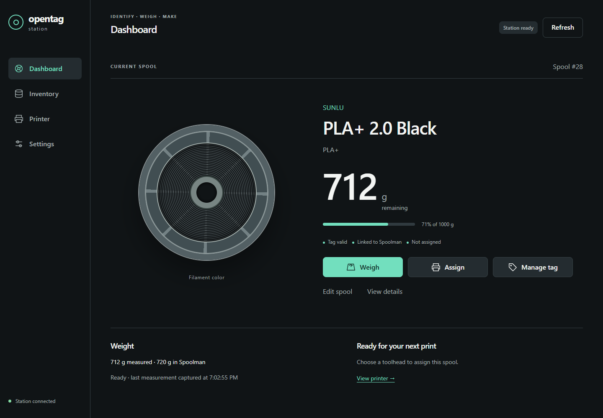

# A station for your filament spools

OpenTag Station brings spool identification, weighing, inventory and printer
assignment to a WT32-SC01 Plus touchscreen and a local browser. Spoolman is the
canonical inventory. NFC tags carry OpenPrintTag data; FilaBridge connects a
resolved spool to a printer toolhead.

This manual describes the **1.0 release candidate** shown in the footer. External
visual review, real WT32 touch/rendering and the final physical/live-service
acceptance checklist remain pending. Screenshots are deterministic demonstrations,
not evidence of a connected station. Touch images approximate production layout
and fonts; they are not captured LVGL framebuffers.

| Start here | Next action |
|---|---|
| Building hardware | Read the [BOM](hardware/bill-of-materials.md), [wiring](hardware/wiring.md) and [power guide](hardware/power.md) |
| Installing firmware | Use [USB installation](installation/web-flasher.md) and [first boot](getting-started/first-boot.md) |
| Using a station | Follow [quick start](getting-started/quick-start.md), then [Weigh](daily-use/weigh.md) or [Assign](daily-use/assign.md) |
| Reusing a tag | Read [Clear / Reuse](daily-use/clear-reuse.md), including pending unlink recovery |
| Developing | Start with [architecture](advanced/architecture.md), [build](contributing/build.md) and [testing](contributing/testing.md) |

[Install / web flasher](https://76cb.github.io/OpenTag-Station/) ·
[Firmware source](https://github.com/76cb/OpenTag-Station) ·
[Documentation source](https://github.com/76cb/OpenTag-Station-Docs)

The installer and documentation are separate GitHub Pages projects. During
candidate review the public installer follows firmware main, so verify its
manifest version before using it; the PR candidate is available from its CI artifact.
There is no final v1.0.0 release yet.
